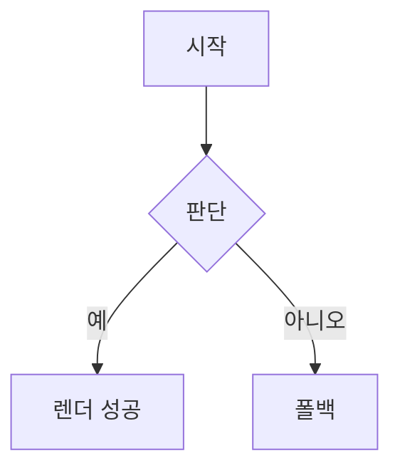

# 문서 뷰 육안 확인 노트

콜아웃 색상 바와 mermaid 렌더를 확인하기 위한 노트.

> [!note] 노트 콜아웃
> 파란 계열 색상 바가 왼쪽에 보여야 한다.

> [!warning] 경고 콜아웃
> 주황 계열 색상 바가 보여야 한다.

> [!tip] 팁 콜아웃
> 초록 계열 색상 바가 보여야 한다.

## Mermaid 다이어그램

끝.
